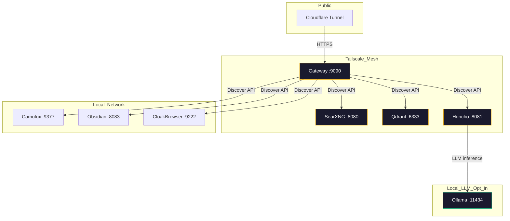

# ForgeDash

Self-hosted all-in-one API platform — deploy SearXNG, Qdrant, Honcho, Camofox, Obsidian, and CloakBrowser behind a single gateway with auto-discoverable APIs, Tailscale mesh, and optional Cloudflare Tunnel for public HTTPS. Optionally add Ollama for local LLM inference.

[](https://github.com/OneByJorah/ForgeDash/actions/workflows/ci.yml)


> **Note:** This README describes the **intended** deployment workflow. The current `bootstrap.sh` scripts are minimal — they copy `.env.example` to `.env`, pull images, and start services. The advanced flag-based deployment (with password generation, Ollama model pulling, Tailscale/Cloudflare integration) documented below is planned functionality. See INTENT.md for the full discrepancy list.

## Quick Start

### Deploy (current)

```bash
git clone https://github.com/OneByJorah/ForgeDash.git
cd ForgeDash
cp .env.example .env
# Edit .env with your passwords: HONCHO_DB_PASSWORD, etc.
docker compose up -d
```

Open **http://localhost:9090** for the onboarding dashboard or **http://localhost:9090/api/v1/discover** for the agent auto-discovery API.

### Automated deploy

```bash
sudo ./bootstrap.sh     # Checks Docker, copies .env.example, pulls images, starts stack
```

### Planned bootstrap (not yet implemented)

The following interface is planned for `bootstrap.sh` but not yet implemented:
- `--auto` — generate passwords and deploy
- `--with-local-llm` — deploy Ollama alongside the stack
- `--with-tailscale` — configure Tailscale mesh
- `--with-public` — configure Cloudflare Tunnel
- `--model <name>` — specify Ollama model

## Features

- **Onboarding API** — Agents hit `/api/v1/discover` to auto-configure to all local services
- **Interactive Setup** — Edit `.env` with your passwords, no manual editing needed
- **Local LLM (Ollama)** — Run Honcho entirely offline with local model inference (opt-in, requires deploying Ollama separately)
- **Cloud or Local** — Choose between local Ollama or cloud OpenRouter during Honcho setup
- **Tailscale Mesh** — Each service gets its own Tailscale identity for secure mesh networking
- **Cloudflare Tunnel** — Optional public HTTPS access via Cloudflare Tunnel (no open firewall ports)
- **Auto-Discovery** — Gateway aggregates health and connection info for all backend services

## Architecture



ForgeDash is the control-plane island in the JorahOne archipelago — the single ingress through which agents discover and connect to every service.

## Setup

### First-time install

```bash
cp .env.example .env
# Edit .env: set SERVER_IP, HONCHO_DB_PASSWORD, HONCHO_TOKEN
# Optional: set CAMOFOX_API_KEY, CAMOFOX_ADMIN_KEY, OBSIDIAN_VAULT_PATH
docker compose up -d
```

### Bootstrap script

```bash
sudo ./bootstrap.sh     # Copies .env, pulls images, starts stack, runs healthcheck
```

### Local LLM (Ollama) Quick Start

Ollama is not included in the default compose stack. To add it, deploy Ollama separately:

```bash
docker run -d --name ollama --network forgedash_default -p 11434:11434 ollama/ollama
docker exec ollama ollama pull llama3.2:1b
```

Then configure Honcho to use the local Ollama instance by setting `LLM_VLLM_BASE_URL=http://ollama:11434/v1` in `.env.honcho`.

## Services

| Service | Internal URL | Description |
|---------|-------------|-------------|
| SearXNG | `http://searxng:8080` | Private meta-search engine |
| Qdrant | `http://qdrant:6333` | Vector database for semantic memory |
| Honcho | `http://honcho:8081` | AI memory & session management |
| Ollama | `http://ollama:11434` | Local LLM inference (opt-in, deploy separately) |
| Camofox | `http://camofox-browser:9377` | Browser automation |
| Obsidian | `http://obsidian:8080` | Notes & knowledge management |
| CloakBrowser | `http://cloak-browser:9222` | Protected browser |

### Endpoints

| Endpoint | Description |
|----------|-------------|
| `/` or `/onboard` | Human-friendly onboarding dashboard |
| `/api/v1/discover` | Agent auto-discovery JSON (auth required) |
| `/api/v1/health` | Aggregated health status of all services |

## Contributing

1. Fork the repo
2. Create a branch: `fix/your-fix` or `feature/your-feature`
3. Open a PR against `main`
4. Response time: I read PRs within 48 hours

## License

MIT — JorahOne LLC
